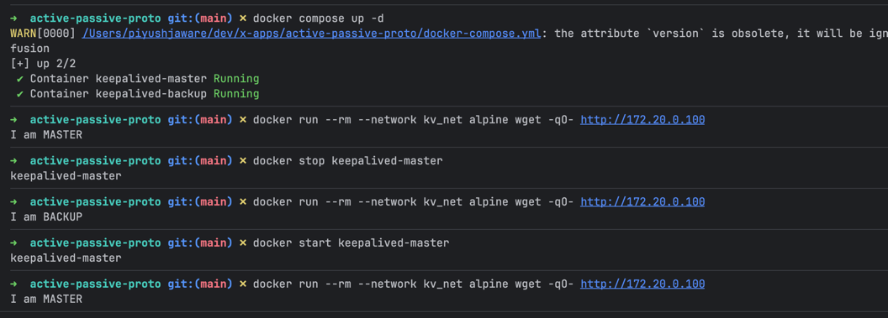

# Active/Passive setup with Keepalived

This repo demonstrates a simple active/passive failover setup using Docker Compose and `keepalived`.



## What it does

- Runs two containers: one `MASTER`, one `BACKUP`
- Gives each container its own stable IP on a private Docker network
- Shares a floating virtual IP (`172.20.0.100`)
- Moves that virtual IP to the active container if the current one fails

## Configuration

### `docker-compose.yml`


- `networks.kv_net`  
  Creates a custom bridge network for the demo.

- `subnet: 172.20.0.0/16`  
  Fixes the IP range so the containers and virtual IP can live in the same private subnet.

- `lb-master` / `lb-backup`  
  Two nearly identical services that run the same base image and web server.

- `image: python:3.11-alpine`  
  Lightweight base image.

- `command`  
  Installs `keepalived`, writes a simple `index.html`, starts `keepalived`, then starts a Python HTTP server on port 80.

- `cap_add: NET_ADMIN, NET_RAW`  
  Required because `keepalived` needs network privileges to manage the VIP and send VRRP traffic.

- `volumes`  
  Mounts the keepalived config file into the container.

- `ipv4_address`  
  Assigns each container a stable IP:
  - master: `172.20.0.11`
  - backup: `172.20.0.12`


### `keepalived`

Both master and backup files define one VRRP group named `VI_1`.

- `state MASTER` / `state BACKUP`  
  Startup role for each node.

- `interface eth0`  
  The network interface keepalived watches and uses.

- `virtual_router_id 51`  
  Shared ID that tells both nodes they are part of the same VRRP group.

- `priority`  
  Higher priority wins if both nodes are alive.
  - master: `101`
  - backup: `100`

- `advert_int 1`  
  Sends VRRP advertisements every 1 second.

- `authentication`  
  Uses a shared password so only matching peers participate.

- `virtual_ipaddress`  
  The floating VIP: `172.20.0.100/16 dev eth0`

## How failover works

1. The master container starts and owns the virtual IP.
2. The backup watches for VRRP advertisements from the master.
3. If the master stops responding, the backup takes over the VIP.
4. When the master returns, its higher priority lets it reclaim the VIP.

## How to run

**Prerequisites:** Docker and Docker Compose installed.

1. Start the containers:

```bash
docker compose up -d
```

2. Test the VIP by hitting it from a temporary container:

```bash
docker run --rm --network kv_net alpine wget -qO- http://172.20.0.100
```

You should see: `I am MASTER`

3. Stop the master to simulate failure:

```bash
docker stop keepalived-master
```

4. Hit the VIP again:

```bash
docker run --rm --network kv_net alpine wget -qO- http://172.20.0.100
```

You should now see: `I am BACKUP` (failover worked!)

5. Restart the master:

```bash
docker start keepalived-master
```

6. After a few seconds, hit the VIP again:

```bash
docker run --rm --network kv_net alpine wget -qO- http://172.20.0.100
```

You should see: `I am MASTER` (master reclaimed the VIP)

## Note

The service name `lb-master` does not make a container the master by itself. The role comes from the mounted `keepalived-*.conf` file.
